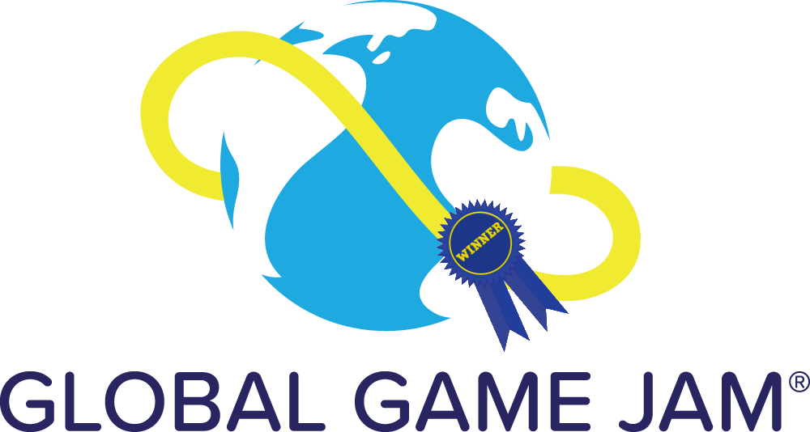

# FixIt95 
###### A tech support simulation experience
---
## Winner of the [2020 Global Game Jam @ FIU](https://globalgamejam.org/2020/games/fixit95-6)

  

---

## Welcome to your new role with FixIt Industries™
_The year is 1995. The tech industry is booming, but nobody really seems to understand it. FixIt Industries™ has created the first contact center for Tech Support to handle this. As an employee of FixIt Industries, you are tasked with repairing, fixing, and resolving all of our customers issues with their various technologies. We expect nothing less than the best!_

_So welcome to FixIt Industries™!_

## How to Play
_You must be taking calls at all times. Log in to your FixIt95™ workstation to begin receiving customer calls. Please remember to use our FixIt™ KB search engine to assist you with resolving our customer's issues._

Press `OK` to begin playing the game. After a period between 1 and 9 seconds, you will receive a call waiting notification. You must accept the call. Listen to the customer's problem, and press the hold button (the yellow pause indicator) to start the search game. 

Letters will fly up towards the top where you must press the correct letter as it appears over the letter in the search box. 

## How to Win
_At FixIt™ Industries, you are constantly being observed and evaluated by the best in the tech industry. If, at any given moment, you let a customer down or a customer feels that his issue wasn't resolved, you will be promptly contacted by HR_

You must correctly type the right letters in all 6 scenarios. 

---

## Credits
* [Chase Keenan](https://github.com/cnkeenan)
* [Armand Karambasis](https://github.com/JJ-Karambasis)
* Christopher DeJesus
* [Alex Marsh](https://github.com/marshy2346)
* Emil Lopez

